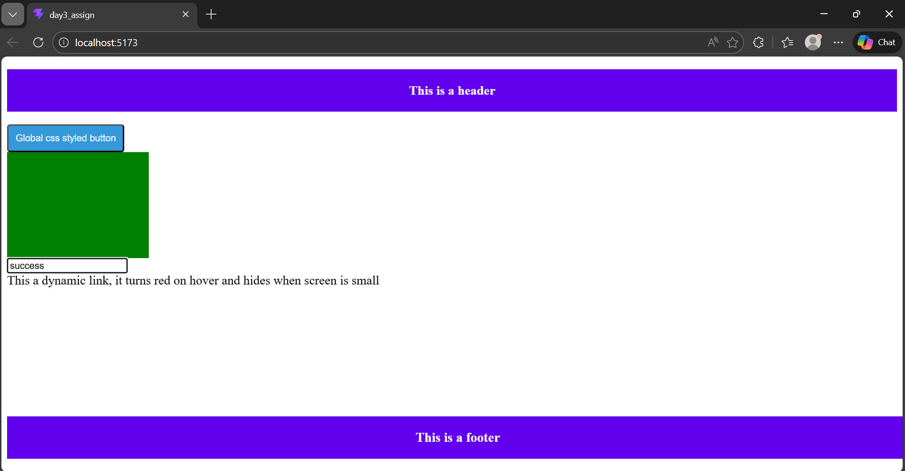
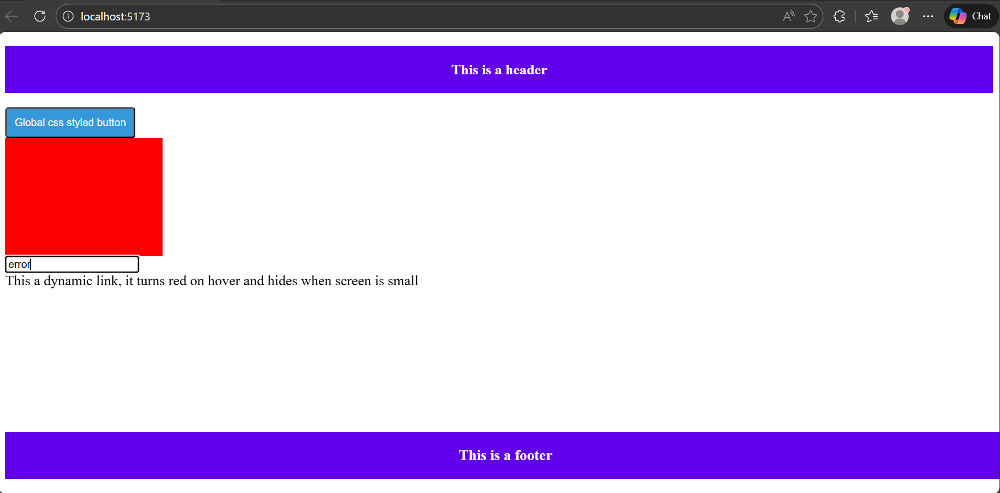
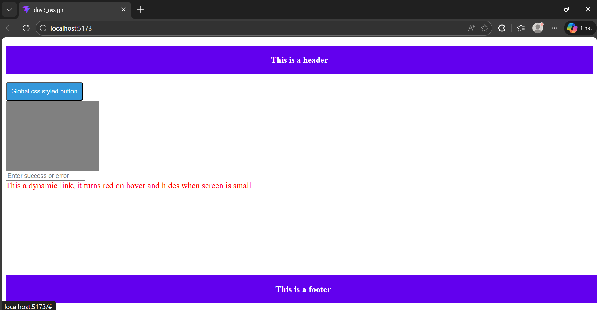
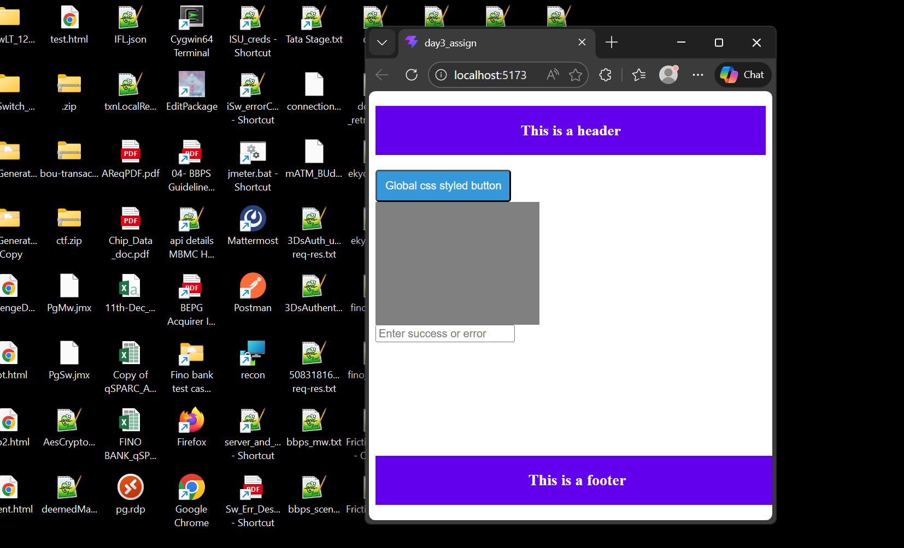

## Brand page
This is project was built using Vite with Js and React compiler

## Layout
The UI is divides into 3 sections : Main, Header and Footer.

## Functionality
The application demonstrates various styling strategies available in React.

## Folder Structure

The project starts from the Day3App.jsx file and global css isloaded from index.css

1. src/components - All the components are present here.
2. The common folder contains all the reusable components used throught the project.

```bash
day3_assign/
├── public/                 # Static assets (favicons, manifest, etc.)
├── src/                    # Main application source code
│   ├── assets/             # Global images, fonts, and static files
│   ├── components/         # Reusable UI components
│   │   ├── layout/         # Structural components
│   │   │   ├── Footer.jsx
│   │   │   └── Header.jsx
│   │   ├── DynamicLink.jsx
│   │   ├── InputBox.jsx
│   │   └── StatusCard.jsx
│   ├── cssmodules/         # Component-specific CSS modules
│   │   ├── Footer.module.css
│   │   └── Header.module.css
│   ├── App.css             # Main application styles
│   ├── App.jsx             # Root component wrapper
│   ├── Day3App.jsx         # Entry point for Day 3 assignment logic
│   ├── index.css           # Global CSS resets and styles
│   └── main.jsx            # Application entry point (Vite)
├── .gitignore              # Files and folders to ignore in Git
├── eslint.config.js        # ESLint configuration
├── index.html              # HTML template
├── package.json            # Project dependencies and scripts
├── package-lock.json       # Locked versions of dependencies
├── README.md               # Project documentation
└── vite.config.js          # Vite build configuration
```

## Browser views




